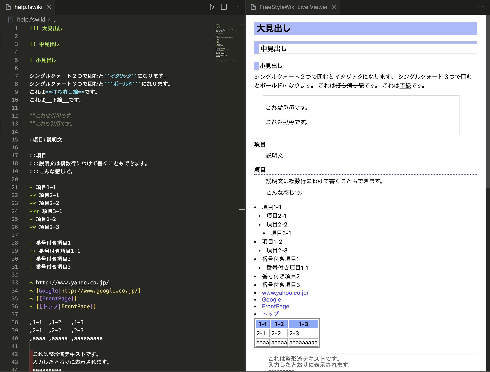

<div align="center">


<h1 style="text-align: center;">FreeStyleWiki Live Viewer for VSCode</h1>

[](https://marketplace.visualstudio.com/items?itemName=kazukiisogai.fs-live-viewer)
[](https://github.com/isso-719/freestylewiki-live-viewer-vscode/actions/workflows/lint.yml)
[](https://github.com/isso-719/freestylewiki-live-viewer-vscode/actions/workflows/test.yml)

<p style="text-align: center;">Live preview FreeStyleWiki (a.k.a FSWiki, FSW) file for VSCode.</p>



</div>

## Install

Download on the [Visual Studio Marketplace](https://marketplace.visualstudio.com/items?itemName=KazukiIsogai.FS-Live-Viewer).

## Getting Started

1. Open your FreeStyle Wiki Article (`.fsw`, `.fswiki` extension file).

2. Open this extension with command pallet.

    -  On macOS.
        1. `Command + Shift + p` to open command pallet.
        2. Put `fslive`.
        3. Select `FreeStyleWiki Live Viewer`.

    - On Windows.
        1. `Ctrl + Shift + p` to open command pallet.
        2. Put `fslive`.
        3. Select `FreeStyleWiki Live Viewer`.

3. Enjoy 🎉

## Supported File Extensions

- `.fsw`
- `.fswiki`

## How to Contribute

1. Clone [freestylewiki-live-viewer-vscode](https://github.com/isso-719/freestylewiki-live-viewer-vscode) repository.

2. Install dependencies.

    ```bash
    npm install
    ```

3. Make changes.

4. Compile TypeScript files.

    ```bash
    npm run compile
    ```

5. Push `F5` key on VSCode and enjoy debugging.

6. Run tests.

    ```bash
    npm lint
    npm test
    ```

## Build

if you want export to `.vsix` file, run below command.

```bash
npm run build
```

## How to add a grammar with paragraph plugins to the parser

1. Open settings.json

    -  On macOS.
        1. `Command + Shift + p` to open command pallet.
        2. Put `> settings`.
        3. Select `Preferences: Open Settings (JSON)`.

    - On Windows.
        1. `Ctrl + Shift + p` to open command pallet.
        2. Put `> settings`.
        3. Select `Preferences: Open Settings (JSON)`.

2. Add `fs-live-viewer.pluginParseSettings` to the settings.json file.

    - if you want to add pre plugin to the parser, add below code.

        ```json
        ...

        "fs-live-viewer.pluginParseSettings": [
            {
                "parseFSWTemplate": "{{pre\n$1\n}}",
                "parseHTMLTemplate": "<pre>$1</pre>",
            }
        ],

        ...
        ```

3. Reopen FreeStyleWiki Live Viewer.

## License

Apache License 2.0. See [LICENSE](./LICENSE) file for more information.

## The Logo

The Logo created by [DALL-E 3](https://openai.com/dall-e-3) AI.

## Reference

- [Help - FreeStyleWiki](https://fswiki.osdn.jp/cgi-bin/wiki.cgi?page=Help)
