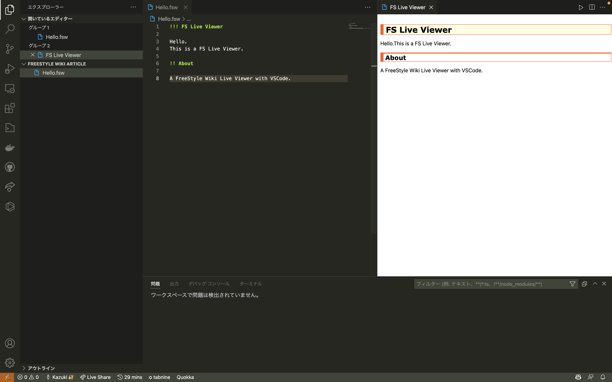

# FS Live Viewer

A FreeStyle Wiki Live Viewer with VSCode.

- Screenshot

- Movie

## HowTo Use?

1. Install via [Visual Studio Marketplace](https://marketplace.visualstudio.com/items?itemName=KazukiIsogai.FS-Live-Viewer) .

2. Open your FreeStyle Wiki Article.

3. Open this extension with command pallet.

    + On macOS.

        1. `Command + Shift + p` to open command pallet.

        2. Put `fslive`.

        3. Select `FS Live Viewer`.

    + On Windows.

        1. `Ctrl + Shift + p` to open command pallet.

        2. Put `fslive`.

        3. Select `FS Live Viewer`.

4. Enjoy 🎉